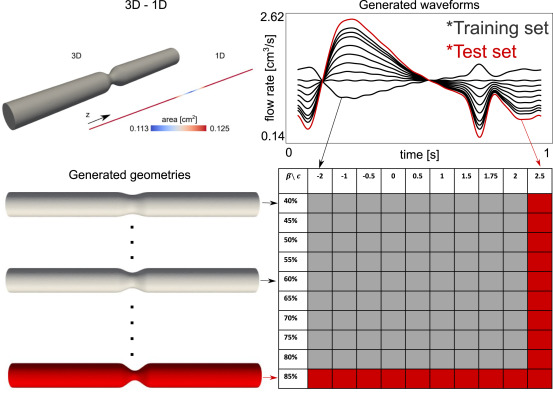

# PCNDE

---

This repository contains the Julia/ipynb codes for the following paper:

**Physics-constrained coupled neural differential equations for one dimensional blood flow modeling**

Hunor Csala, Arvind Mohan, Daniel Livescu, Amirhossein Arzani

Paper published in Computers in Biology and Medicine: [https://doi.org/10.1016/j.compbiomed.2024.109644](https://doi.org/10.1016/j.compbiomed.2024.109644)

Preprint on arXiv: [https://arxiv.org/abs/2411.05631](https://arxiv.org/abs/2411.05631)

---

The src directory contains helper function for calculating numerical derivatives with different schemes and for training with different optimizers.

The trained_weights directory contains the trained weights for the momentum and continuity equation models in .jld2 format and also the weights for the pressure model.

PCNDE_train_QS.jl has the momentum and continuity equation training.

PCNDE_InferenceFitPressure.ipynb has the PCNDE model in inference mode, and the pressure model in training/inference mode. This jupyter notebook also has some of the plots from the paper, for example parts of Fig. 4, Fig. 5, Fig. 6 and Fig. 7. Note that some of the heatmaps don't render well on GitHub so they have been commented out. Also note that the pressure model is trained for a few more epochs in transfer learning mode, the final numerical results are all either equal or slightly better than the values presented in the paper.

The data directory contains the 3D averaged data for training and the 1D FEM data for comparison.

___
  
